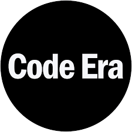

# CODE ERA - Learn Programming 🚀



CODE ERA is an interactive learning platform designed to make programming concepts easy and fun to learn through tutorials, examples, and quizzes.

## 🌟 Features

- 🖥️ **Interactive Learning**: Learn by doing with browser-based coding examples
- 📚 **Structured Curriculum**: From basics to advanced topics
- ✔️ **Practice Quizzes**: Test your knowledge with immediate feedback
- 🏆 **Achievement Badges**: Get rewarded for your progress
- � **Multiple Topics**: Covers essential programming concepts

## 📂 Project Structure

CODE-ERA/
├── Basics/              # Basic programming concepts
│   └── qbasic.html

├── IF/                  # If-Else statements
│   └── qif.html

├── LOOPS/               # Loops concepts
│   └── qloop.html

├── Arrays/              # Arrays tutorials
│   └── qarray.html

├── Strings/             # Strings manipulation
│   └── qtring.html

├── home.html            # Home page

├── learn.html           # Learning portal

├── quiz.html            # Quizzes section

├── contact.html         # Contact page

├── login.html           # User login

├── register.html        # User registration

├── lg.jpg               # Project logo
└── README.md            # This file

## 🛠️ Technologies Used

- 💻 HTML5
- 🎨 CSS3
- ✨ Font Awesome (for icons)
- 🌈 Modern UI design with CSS variables

## 🚀 Getting Started

1. Clone the repository:
   ```bash
   git clone [https://github.com/Vasudha48/CODE-ERA.git](https://github.com/Vasudha-Patil/CODE_ERA)
   ```
2. Open the `home.html` file in your preferred browser
3. Start learning programming concepts!

## 📚 Learning Resources

- Basic Programming ➡️ `/Basics/qbasic.html`
- If-Else Statements ➡️ `/IF/qif.html`
- Loops ➡️ `/LOOPS/qloop.html`
- Arrays ➡️ `/Arrays/qarray.html`
- Strings ➡️ `/Strings/qtring.html`

## 📬 Contact

- 👩‍💻 Creator: Vasudha Patil
- 📧 Email: [vasudhavenkatpatil@gmail.com](mailto:vasudhavenkatpatil@gmail.com)
- 📞 Phone: [+91 7821907824](tel:+917821907824)
- 🔗 LinkedIn: [Vasudha Patil](https://www.linkedin.com/in/vasudha-patil-b19499231/)
- 📷 Instagram: [@vasudha_patil_](https://www.instagram.com/vasudha_patil_/)
- 💻 GitHub: [Vasudha-Patil](https://github.com/Vasudha48)

## 📜 License

Made with ❤️ by [Vasudha Patil](https://github.com/Vasudha48) | © 2023 CODE ERA

